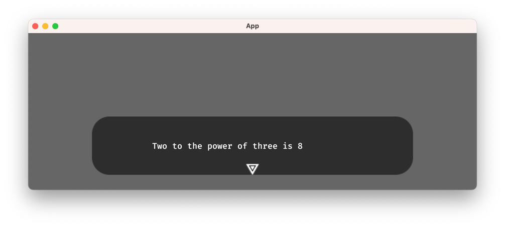

# Custom Functions

As mentioned in the chapter [Functions](../../getting-started/writing-in-yarn/functions.md), Yarn can access user-defined functions.
A collection of functions is called a *library* and can be accessed through a `DialogueRunner`.

## Function Registration

For an easy example, let's modify the code used in the [Quick Start](../quick-start.md) to provide a simple `pow` function to Yarn:
```rust
fn spawn_dialogue_runner(mut commands: Commands, project: Res<YarnProject>) {
    let mut dialogue_runner = project.create_dialogue_runner();
    // Add our custom function to the dialogue runner
    dialogue_runner.library_mut().add_function("pow", pow);
    dialogue_runner.start_node("Start");
    commands.spawn(dialogue_runner);
}

fn pow(base: f32, exponent: f32) -> f32 {
    base.powf(exponent)
}
```

The following snippet is of special importance:
```rust
dialogue_runner.library_mut().add_function("pow", pow);
```
The first parameter of `add_function()` is the name of the function as seen by Yarn, `"pow"` in this case.
The second parameter is the Rust function that will be called in the background.
Here, we reference the function definition of `fn pow(...)`, but you could also register a lambda.


This `pow` function can now be called from the Yarn file like this:

```text
title: Start
---
Two to the power of three is {pow(2,3)}
===
```

Which will result in the following output:


## Allowed Signatures

Custom functions need to follow some rules. Don't worry, they're pretty lax.

- Their parameter and output types need to be primitive types or `String`
- Parameters are allowed to be references
- Parameters can have the special type `YarnValue`, which stands for any input type.
  Additionally, functions are assumed to have no side effects. You can read the full list of requirements in the docs for `YarnFn`.

Here are some examples of valid functions:
```rust
fn add(a: f32, b: f32) -> f32 {
    a + b
}

fn concat(a: &str, b: &str) -> String {
    format!("{a}{b}")
}

fn greet(name: &str, age: usize) -> String {
    format!("Hello {name}, you are {age} years old!")
}

fn format_anything(value: YarnValue) -> String {
    format!("Got the following value: {value}")
}
```

If you need functions that have side effects, e.g. for manipulating the game world, use [custom commands](creating-commands.md) instead.

## Size constraints

Registered Rust functions can have a maximum of 16 parameters.
If you need more, you can wrap parameters in tuples:

```rust
fn add((a, b): (f32, f32)) -> f32 {
    a + b
}
```

Tuples are treated as separate parameters when calling the function from Yarn:
```text
title: Start
---
Two plus three is {add(2, 3)}
===
```

Since tuples can be nested, you can use have potentially infinite parameters.
